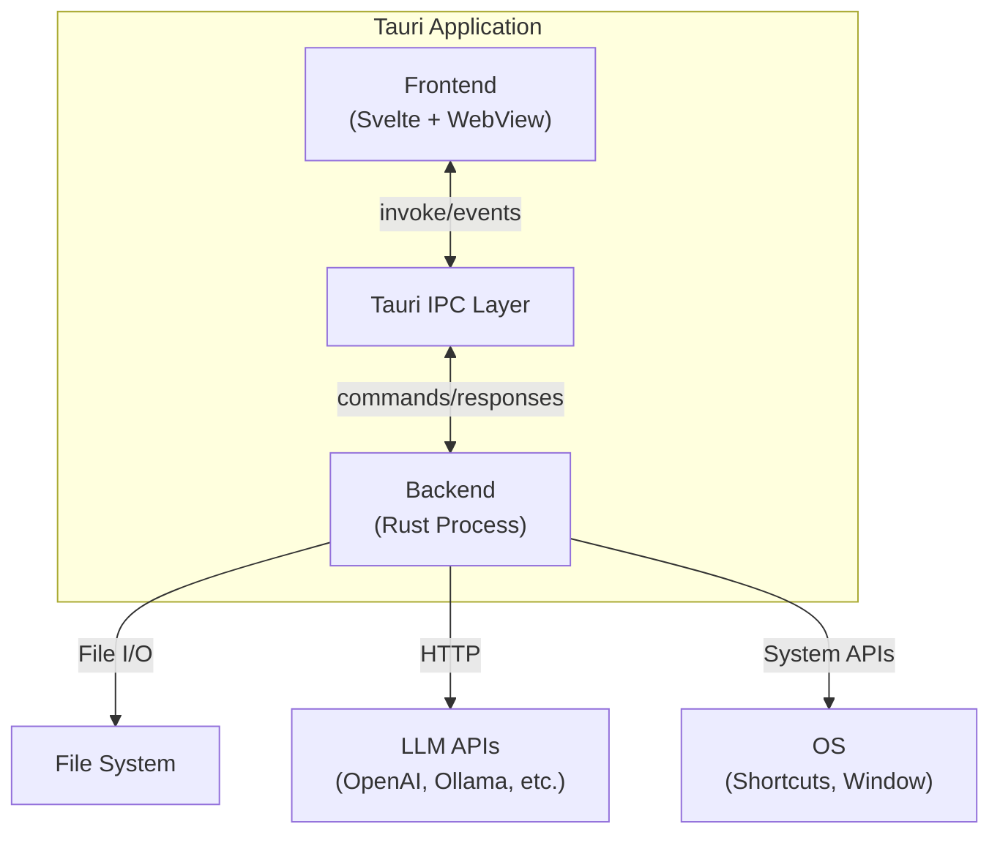
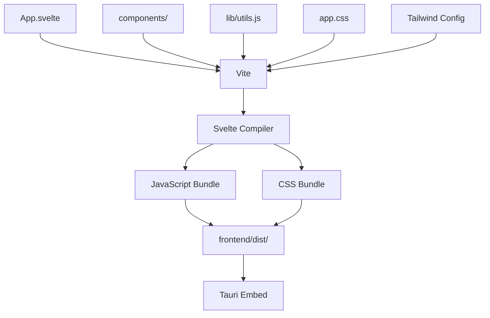
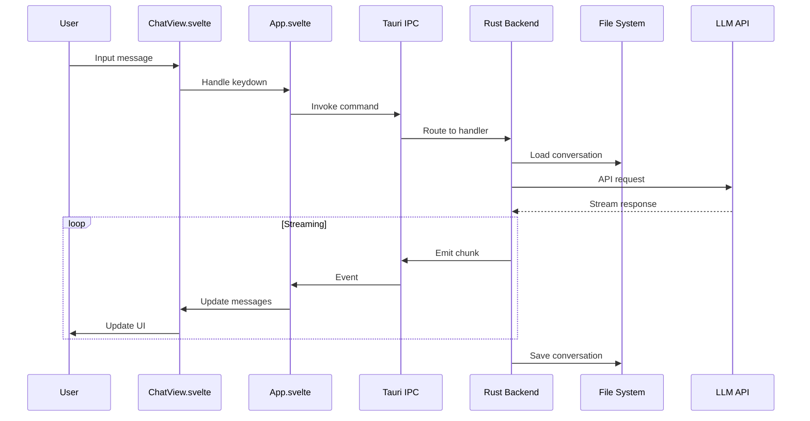

# Architecture Overview

Fast Chat Launcher is built using **Tauri 2.0**, a framework that combines a Rust backend with a web frontend. The architecture follows a clear separation between the desktop application layer (Rust) and the user interface layer (Svelte).

## Tauri Architecture

Tauri applications consist of two main parts:

1. **Backend (Rust)**: Runs as a native process, handles system integration, file I/O, and API calls
2. **Frontend (Web)**: Runs in a WebView, provides the user interface using web technologies

Communication between frontend and backend happens via:
- **Tauri Commands**: Rust functions exposed to the frontend via `#[tauri::command]` attributes
- **Tauri Events**: Real-time communication for streaming responses
- **Invoke API**: Frontend calls backend commands using `invoke()`



## Repository Structure

```
ai-launcher/
├── desktop/                # Tauri Rust application
│   ├── src/
│   │   ├── main.rs         # Application entry point & setup
│   │   ├── models/         # Data structures
│   │   ├── encryption/     # Secret management
│   │   ├── storage/        # File I/O operations
│   │   ├── api/            # LLM provider clients
│   │   ├── commands/       # Tauri command handlers
│   │   └── window/         # Window & shortcut management
│   ├── icons/              # Application icons
│   ├── Cargo.toml          # Rust dependencies
│   └── tauri.conf.json     # Tauri configuration
│
├── frontend/               # Svelte web application
│   ├── src/                # Source files
│   │   ├── App.svelte      # Main orchestrator component
│   │   ├── main.js         # Application entry point
│   │   ├── app.css         # Global styles
│   │   ├── ShortcutPicker.svelte  # Keyboard shortcut picker
│   │   ├── components/     # UI components
│   │   └── lib/            # Utility functions
│   ├── package.json        # Node dependencies
│   └── vite.config.js      # Build configuration
│
├── _docs_/                 # Documentation
└── README.md               # Project overview
```

## The `desktop/` Folder

The `desktop/` folder contains the **Tauri Rust application** - the native backend of the app.

### Purpose

- Provides the native desktop application wrapper
- Handles all system-level operations (file I/O, global shortcuts, window management)
- Manages LLM API calls and data persistence
- Exposes commands to the frontend via Tauri's IPC system

### Key Components

**`src/main.rs`**
- Application entry point and Tauri setup
- Command registration and window initialization
- Global shortcut handler registration

**`src/models/`**
- Data structures: `Settings`, `ProviderParams`, `Conversation`, `Message`
- Serialization/deserialization definitions

**`src/encryption/`**
- Secret management and encryption/decryption
- API key storage in encrypted format
- Key derivation from system identifiers

**`src/storage/`**
- File I/O for settings (`config.json`)
- Conversation persistence (JSON files)
- Path management and validation

**`src/api/`**
- LLM provider clients (Ollama, OpenAI, Google, LM Studio, Custom)
- Streaming response handling
- Provider-agnostic API interface

**`src/commands/`**
- Tauri command handlers exposed to frontend
- Settings, conversations, and message commands
- Business logic orchestration

**`src/window/`**
- Window visibility management
- Global keyboard shortcut parsing and registration
- Shortcut picker state management

**`tauri.conf.json`**
- Application configuration
- Window settings and build process
- Security permissions

**`Cargo.toml`**
- Rust dependencies and project metadata
- Includes Tauri framework, HTTP client, encryption, and serialization libraries

### Build Process

Tauri orchestrates the build: compiles the Rust backend, bundles the frontend, and creates platform-specific installers.

## The `frontend/` Folder

The `frontend/` folder contains the **Svelte web application** - the user interface layer.

### Purpose

- Provides the complete user interface
- Handles user interactions and state management
- Communicates with backend via Tauri's invoke API
- Renders markdown responses and manages conversation display

### Technology Stack

- **Svelte**: Reactive component framework that compiles to vanilla JavaScript
- **Vite**: Development server and build tool with HMR
- **Tailwind CSS**: Utility-first styling framework
- **Additional libraries**: Tauri API bindings, markdown rendering, XSS protection, icons

### Key Components

**`src/App.svelte`**
- Main orchestrator component (~400 lines)
- Manages application state and routing between views
- Coordinates between launcher and chat modes
- Handles global keyboard shortcuts and window events

**`src/components/ChatView.svelte`**
- Chat interface with message display and input
- Handles scroll management and auto-scroll behavior
- Manages copy buttons for code blocks
- Receives streaming message updates

**`src/components/LauncherView.svelte`**
- Launcher mode interface with search input
- Displays conversation history list
- Handles settings button and conversation selection

**`src/components/ConversationList.svelte`**
- Renders list of conversation history items
- Manages delete all functionality
- Handles loading and empty states

**`src/components/ConversationItem.svelte`**
- Individual conversation item in the list
- Displays title, timestamp, and message count
- Handles click and delete actions

**`src/components/Message.svelte`**
- Individual message rendering (user or assistant)
- Handles markdown rendering and loading states
- Supports code block copy functionality

**`src/components/SettingsPanel.svelte`**
- Settings UI panel with slide-in animation
- Manages provider selection and configuration
- Handles keyboard shortcut picker

**`src/components/DeleteModal.svelte`**
- Confirmation modal for deleting all conversations
- Modal overlay with backdrop blur

**`src/lib/utils.js`**
- Utility functions for markdown rendering
- Timestamp formatting helpers
- Shared across components

**`src/ShortcutPicker.svelte`**
- Keyboard shortcut capture component
- Listens for key combinations and formats display

**`src/main.js`**
- Application entry point that initializes Svelte

**`vite.config.js`**
- Build and development server configuration

### Build Process

Vite compiles Svelte components and processes CSS, then bundles everything for Tauri to embed into the native app.



## How It All Fits Together

### Data Flow Example: Sending a Message

User input triggers a frontend invoke, which routes through Tauri IPC to the backend. The backend loads the conversation, calls the LLM API, and streams response chunks back via events. The frontend updates the UI reactively as chunks arrive, and the backend saves the completed conversation.



## Design Principles

### Modular Component Structure
- **Backend**: Organized into logical modules (models, storage, api, commands, window)
- **Frontend**: Component-based architecture with focused, reusable components
- Clear separation of concerns for maintainability and testability
- **Rationale**: Modular structure improves code organization, makes testing easier, and enables better collaboration. Components are self-contained and can be modified independently.

### Component-Level State Management
- Uses Svelte's built-in reactivity for state
- State managed at the App.svelte orchestrator level
- Props passed down to child components
- No external state management libraries
- **Rationale**: Application state complexity doesn't warrant additional abstraction layers. Component props provide clear data flow.

### Security-First Secrets
- API keys stored in encrypted format
- Encryption key derived from system identifiers
- **Rationale**: Never store sensitive credentials in plain text, even in local storage

### Human-Readable Data Storage
- Conversations and settings stored as JSON files
- **Rationale**: Simple, debuggable, and easy to backup or migrate
